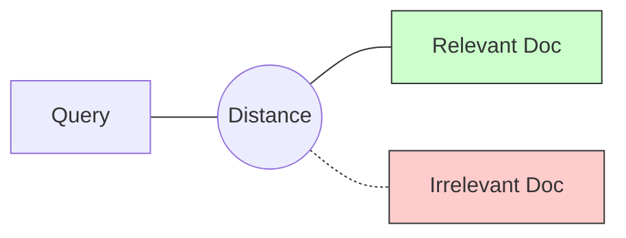

> [!CAUTION]
> Создано Manus/Gemini без верификации. Известные проблемы:
> - Расшифровка E5 неверна (корректно: EmbEddings from bidirEctional Encoder rEpresentations — пять E)

# E5: Глубокое погружение в концепции и архитектуру

## 1. Что такое E5?
**E5 (EmbEddings from bidirection Encoder representations)** — это семейство моделей, специально обученных для задач информационного поиска (Retrieval). В отличие от классического BERT, E5 оптимизирована для того, чтобы похожие по смыслу тексты находились близко в векторном пространстве.

## 2. Архитектура Transformer Encoder
Модель `multilingual-e5-large` основана на базе **XLM-RoBERTa**.

- **Бидирекциональность**: Модель "смотрит" на предложение целиком (слева направо и справа налево), что позволяет лучше понимать контекст слов.
- **Pooling**: Вместо того чтобы выдавать вектор для каждого слова, модель объединяет их в один "смысловой отпечаток" всей фразы.
- **Размерность 1024**: Каждое предложение превращается в точку в 1024-мерном пространстве.

## 3. Контрастивное обучение (Contrastive Learning)
E5 обучалась на парах (Запрос, Релевантный ответ).
- **Положительные примеры**: Сближаются в пространстве.
- **Отрицательные примеры**: Расталкиваются как можно дальше.

## 4. Почему 1024 измерения?
Чем выше размерность, тем больше тонких нюансов смысла может закодировать модель. 
- **1024** — это "золотой стандарт": достаточно много для глубокой семантики, но не слишком накладно для памяти (в отличие от моделей с 4096 измерениями).

## 5. Ограничение в 512 токенов
Все модели на базе BERT имеют "окно видимости". 
- Если текст длиннее ~400-500 слов, модель просто проигнорирует хвост.
- **Решение**: Нарезка на чанки (Chunking).

## 6. Место в RAG-пайплайне
E5 — это твой "первый фильтр". Она мгновенно находит 100 кандидатов из миллионов документов. Она не должна быть идеально точной, она должна быть **быстрой и охватывающей**.

## 7. Продвинутые техники: Matryoshka Embeddings
> [!NOTE]
> Базовая модель `multilingual-e5-large` не поддерживает сжатие "из коробки" так же эффективно, как специализированные варианты. Для использования этой техники рекомендуется брать версии, явно помеченные как **Matryoshka-trained** (например, от Sentence Transformers).

- **Масштабируемость**: Если вы используете Matryoshka-вариант, вы можете хранить в памяти только первые 256 или 512 измерений из 1024.
- **Эффективность**: Это ускоряет поиск в 2-4 раза при потере точности всего в 2-3%. Это критично для мобильных устройств или сверхбольших баз знаний.

## 8. HyDE (Hypothetical Document Embeddings)
Техника HyDE помогает, когда запрос пользователя слишком "бедный" на факты.
1. **Генерация**: Claude создает гипотетический (вымышленный) ответ на вопрос.
2. **Поиск**: Мы ищем не по вопросу, а по эмбеддингу этого вымышленного ответа.
- **Зачем?** Эмбеддинги документов ("passage:") лучше мэтчатся с эмбеддингами других документов ("гипотетический ответ"), чем с эмбеддингом вопроса.

## 9. Продвинутый Chunking: Семантическая нарезка
Вместо того чтобы резать текст по 500 символов, мы используем E5 для определения границ:
- Проходимся по тексту скользящим окном.
- Если расстояние между эмбеддингами двух соседних абзацев резко возрастает — значит, тема сменилась.
- **Результат**: Чанки всегда содержат законченную мысль, что радикально повышает качество RAG.
