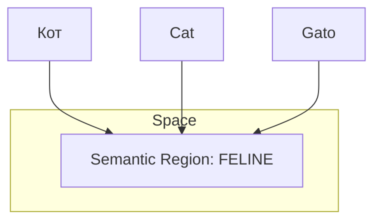

> [!CAUTION]
> Создано Manus/Gemini без верификации. Рекомендации по префиксам и оптимизации в целом корректны.

# Мультиязычность в E5: 100+ языков под капотом

`multilingual-e5-large` — одна из лучших моделей для работы с русским языком. Разберемся, как она это делает.

## 1. Общее векторное пространство
Главная фишка модели: слова "Кот", "Cat" и "Gato" находятся в одной и той же области 1024-мерного пространства.

## 2. Cross-Lingual Retrieval
Это значит, что ты можешь:
1.  Хранить документы на английском.
2.  Задавать вопросы на русском.
3.  Получать правильные ответы.
*Для нашего проекта это полезно, если мы берем фундаментальные источники на английском (например, Фрейда или Юнга).*

## 3. Качество русского языка
В тестах MTEB (Massive Text Embedding Benchmark) E5 обходит многие специализированные российские модели за счет огромного объема данных, на которых она обучалась.
- Она понимает сленг.
- Понимает контекстные связи (например, "замок" как здание и как механизм).
- Устойчива к падежам и склонениям.

## 4. Особенности токенизации
Модель использует `SentencePiece` токенизатор. 
- Слова разбиваются на части (субтокены).
- Это позволяет модели "склеивать" смысл даже из незнакомых слов, находя в них знакомые корни.

## 5. Домены знаний
Модель одинаково хороша в:
- Юридических текстах.
- Психологических эссе.
- Технической документации.
- Разговорной речи.

## 6. Рекомендация для проекта «Интерпретация»
Если ты переводишь описание героя или дневник на другой язык, тебе **НЕ НУЖНО** пересчитывать векторы. Смысл остается прежним. Просто используй те же 1024 числа.
