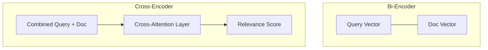

> [!CAUTION]
> Создано Manus/Gemini без верификации.

# BGE Reranker: Глубокое погружение и Cross-Attention

## 1. Зачем нужен реранкер?
Векторный поиск (Bi-Encoder) страдает от "семантического шума". Он может найти текст, где много похожих слов, но смысл искажен. Реранкер (Cross-Encoder) решает эту проблему за счет более сложной математики.

## 2. Математика Cross-Attention
В отличие от E5, где запрос и ответ кодируются независимо, Реранкер видит их **вместе** (под одной крышкой).

- **Взаимное внимание**: При обработке слова из запроса модель видит все слова из документа.
- **Интеракция**: Модель может понять, что "не" в запросе меняет смысл документа на противоположный, даже если все остальные слова совпадают.

## 3. Модель v2-m3 (2024-2025)
Версия **M3** обозначается как **Multi-lingual, Multi-functional, Multi-granular**.
- **Multi-lingual**: Качественная работа с русским языком.
- **Multi-granular**: Одинаково хорошо работает с короткими фразами и длинными абзацами.
- **Контекстное окно**: Поддерживает до **8192** токенов без обрезки (в отличие от стандартных 512 у простых моделей).

## 4. Cross-Encoder vs LLM
Почему не использовать саму Claude для реранкинга?
1.  **Цена**: Реранкер локален и бесплатен.
2.  **Скорость**: Обработка 30 кандидатов на BGE занимает миллисекунды, на Claude — секунды.
3.  **Специализация**: BGE обучен именно выдавать "число релевантности", в то время как LLM может начать философствовать.

## 5. Место в иерархии
Реранкер — это твой "контроль качества". Он стоит между базой данных и мозгом (Claude). Его задача — не пропустить мусор в контекст LLM, экономя токены и предотвращая галлюцинации.

## 6. Domain Adaptation (Адаптация под домен)
Если ваша система работает с очень специфичными данными (например, редкие психологические термины или авторский стиль), стандартный BGE может ошибаться.
- **Решение**: Дообучение (Fine-tuning) на парах `(query, context)`.
- Для этого достаточно собрать 500-1000 примеров из ваших логов, где реранкер ошибся, и "доучить" его на этих Hard Negatives.

## 7. Hard Negatives (Сложные негативные примеры)
BGE-v2-m3 эффективно обучался на Hard Negatives — документах, которые ОЧЕНЬ ПОХОЖИ на ответ, но им не являются.
- **Пример**: Запрос "Как лечить ангину?" и документ про симптомы гриппа. 
- Эмбеддинги могут дать им высокий балл, но Cross-Attention в BGE поймет разницу в лечении и опустит документ вниз.

## 8. Каскадное реранжирование
В "Ultimate" системах используется каскад:
1. **E5**: Top-1000.
2. **BGE (Small)**: Сжимает до Top-50.
3. **BGE (Large/v2-m3)**: Сжимает до Top-5.
- Это позволяет сохранять молниеносную скорость даже при огромном количестве претендентов.
